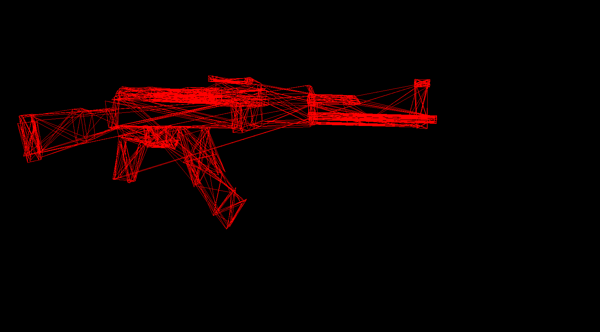

# python-renderer

Tried to push python + pygame to its limits to render 3D models. I used numba to use JIT compilation, but its still pretty dog for models with lots of vertexes.

It works by parsing .obj files.

## Some cool stuff I rendered:

- NVIDIA logo


- Car


- Gun


## How to run

Can't quite remember, this was a while ago.

- Create virtual env
```
python3 -m venv venv
```
- Activate env
```
source venv/bin/activate
```
- Install dependencies
```
pip install -r requirements.txt
```
- Run the program
```
python3 main.py
```

Currently the input .obj file is hardcoded (line 20 in `main.py`). Change this to render your file. I will change this at somepoint if I remember.